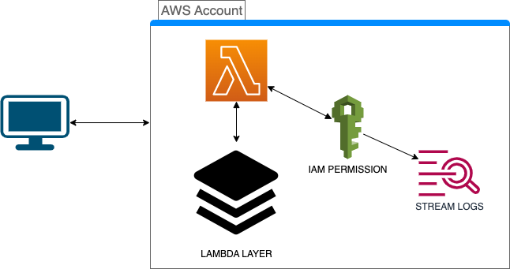

# Module Lambda



Module prebuilt for automate the AWS lambdas functions using a Node.js layer runtime [Layer](https://github.com/hendrixroa/terraform-aws-lambda-layer)

- Terraform version:  `0.13.+`

## How to use

```hcl
module "lambda_layer" {
  source = "hendrixroa/lambda-layer/aws"

  lambda_layer_name = "LambdaNodejsLayer"
  s3_bucket_id      = aws_s3_bucket.mybucket.id
}

module "myLambda" {
  source = "hendrixroa/lambda/aws"

  enabled              = 1
  code_location        = "path/to/your/code"
  filename             = "yournamepackage.zip"
  lambda_iam_role      = aws_iam_role.lambda_basic_role.arn
  lambda_function_name = "MyFunctionName"
  lambda_runtime       = "nodejs16.x"
  layer_arn            = module.lambda_layer.arn
   
   #Subnets and Security groups if apply
   subnets = [ list of subnets]
   sg_ids  = [ security group ids]

  environment_variables = {
    foo = "bar"
  }
}
```
